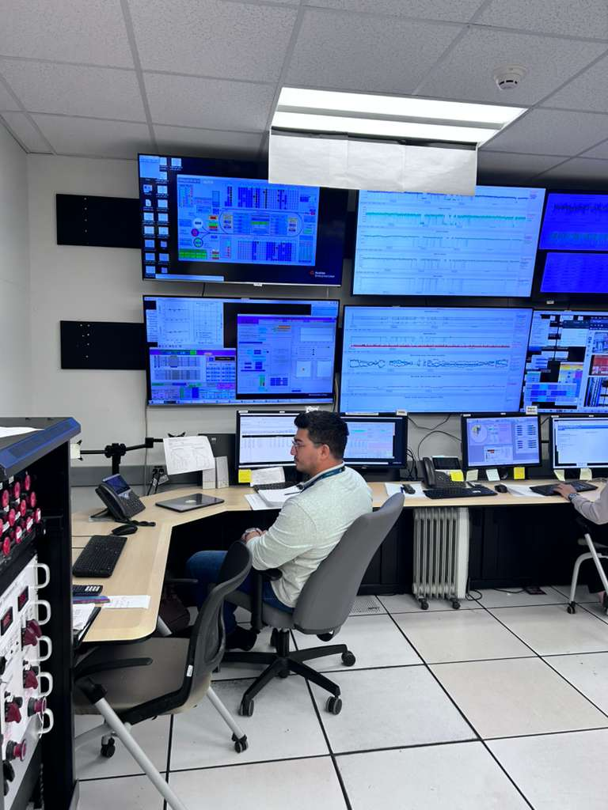
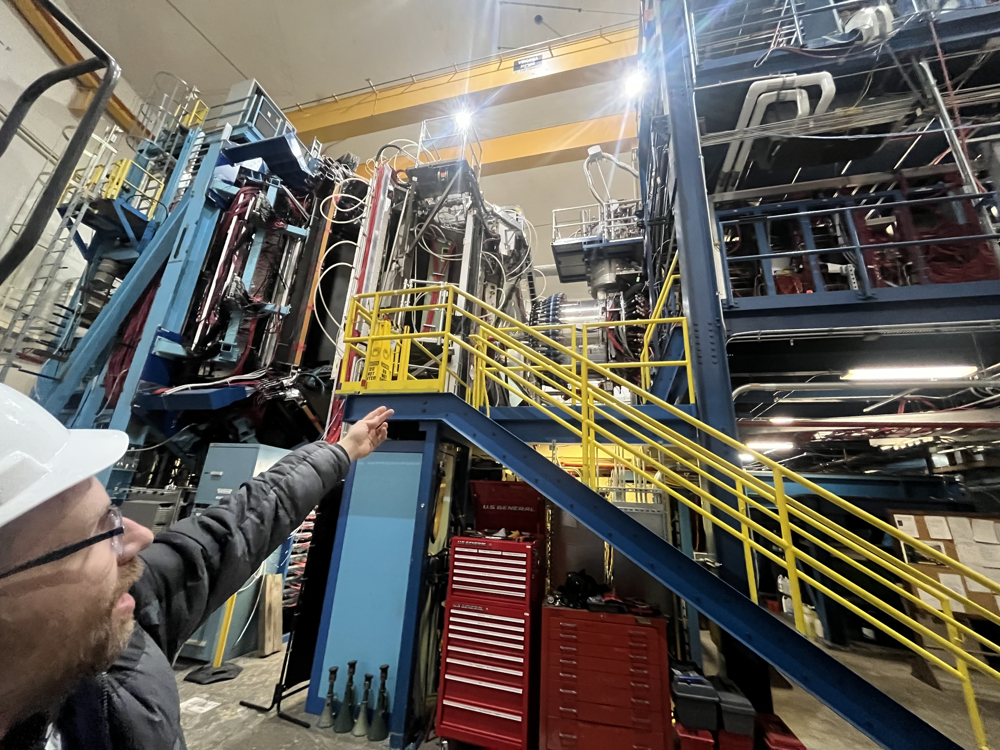

# Slices ✂️
My undergraduate research project analyzing antineutron electroproduction using data from the CLAS12 detector at Jefferson Lab.

* [Research Presentation](./Research_Presentation.pdf)

<iframe src="./Research_Poster.pdf" width="100%" height="600px">
  This browser does not support PDFs. Please download the PDF to view it: <a href="./Research_Poster.pdf">Download PDF</a>
</iframe>

# Physics Analysis (Python)

These scripts contain the main physics analysis, kinematic matching algorithms, and data visualizations:

* [`FD_cuts_v1.py`](https://github.com/007kev/Slices/blob/main/FD_cuts_v1.py): Analysis and momentum cuts focusing on electrons detected in the Forward Detector.

* [`FT_cuts_v1.py`](https://github.com/007kev/Slices/blob/main/FT_cuts_v1.py): Analysis and momentum cuts focusing on electrons detected in the Forward Tagger.

# Data Conversion (C++ / ROOT)

These files handle the low-level processing of the raw detector data:

* [`v4_hipo_root_pppim.C`](https://github.com/007kev/Slices/blob/main/v4_hipo_root_pppim.C): A C++ ROOT macro used to filter and convert the raw Jefferson Lab .hipo data files into manageable .root trees for analysis.

* [`hipo_to_root_annotate.ipynb`](https://github.com/007kev/Slices/blob/main/hipo_to_root_annotate.ipynb): An annotated Jupyter Notebook breaking down the C++ conversion macro line-by-line. (Highly recommended for beginners!)

Later, I took shifts at Jefferson Lab to collect data and operate the target in Hall C.

# Features
- Instructions for;
    - creating a jlab computing account and accessing the interactive farm
    - reading the conversion macro 'hipo_to_root_annotate.ipynb'

* [References sheet](https://gist.github.com/007kev)

I also received special trainning and clearance to take a tour through Hall B, where the amazing CLAS12 Spectrometer was housed.

